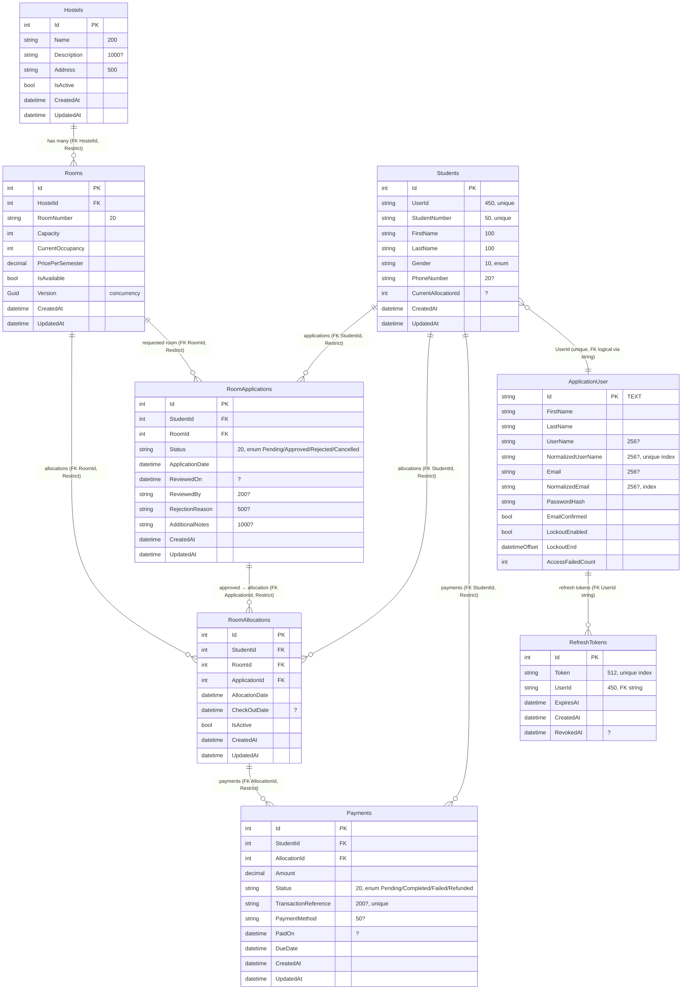

# HostelSystem — Schema Reference & ERD

## Overview

Domain follows **DDD + Clean Architecture**. Two DbContexts share one logical database (pluggable — can be split).

- **AppDbContext** (`HostelSystem.Infrastructure`) — domain: `Hostels`, `Rooms`, `Students`, `RoomApplications`, `RoomAllocations`, `Payments`.
- **AppIdentityDbContext** (`HostelSystem.Identity`) — ASP.NET Identity + `RefreshTokens`.

Provider: `Sqlite` (dev) / `SqlServer` (prod) — see `docs/database-provider.md`.

---

## ERD

### Text fallback (if Mermaid not rendered)

- `Hostels 1—* Rooms` via `Rooms.HostelId`
- `Students 1—* RoomApplications` via `RoomApplications.StudentId`
- `Rooms 1—* RoomApplications` via `RoomApplications.RoomId`
- `Students 1—* RoomAllocations` via `RoomAllocations.StudentId`
- `RoomApplications 1—* RoomAllocations` via `RoomAllocations.ApplicationId`
- `RoomAllocations 1—* Payments` via `Payments.AllocationId`
- `Students 1—* Payments` via `Payments.StudentId`
- `ApplicationUser 1—* RefreshTokens` via `RefreshTokens.UserId` (string, not enforced FK)

All FKs are `OnDelete: Restrict` — prevents cascade deletes; application handles ordering.

---

## Tables

### `Hostels`

| Column | Type (SQLite / SQL Server) | Constraints |
|--------|---------------------------|-------------|
| `Id` | INTEGER / int | PK, autoincrement |
| `Name` | TEXT 200 / nvarchar(200) | required |
| `Description` | TEXT 1000 / nvarchar(1000) | nullable |
| `Address` | TEXT 500 / nvarchar(500) | required |
| `IsActive` | INTEGER bool / bit | default 1 |
| `CreatedAt` | TEXT / datetime2 | required |
| `UpdatedAt` | TEXT / datetime2 | nullable |

### `Rooms`

| Column | Type | Constraints / Notes |
|--------|------|---------------------|
| `Id` | INTEGER / int | PK |
| `HostelId` | INTEGER | FK → `Hostels.Id` |
| `RoomNumber` | TEXT 20 | required, not unique (unique per hostel via app rule) |
| `Capacity` | INTEGER | > 0 |
| `CurrentOccupancy` | INTEGER | `CHECK CK_Room_Occupancy: 0 <= CurrentOccupancy <= Capacity` |
| `PricePerSemester` | TEXT (SQLite decimal) / decimal(18,2) | > 0 |
| `IsAvailable` | INTEGER bool | |
| `Version` | TEXT GUID | concurrency token |
| `CreatedAt` / `UpdatedAt` |  |  |

**Indexes:**
- `IX_Rooms_HostelId` (FK)
- `IX_Rooms_HostelId_IsAvailable_CurrentOccupancy` (composite) — **covers availability query**

### `Students`

| Column | Type | Constraints |
|--------|------|-------------|
| `Id` | INTEGER | PK |
| `UserId` | TEXT 450 | required, **unique** `IX_Students_UserId` |
| `StudentNumber` | TEXT 50 | required, **unique** `IX_Students_StudentNumber` |
| `FirstName` / `LastName` | TEXT 100 | required |
| `Gender` | TEXT 10 | enum `Male/Female` |
| `PhoneNumber` | TEXT 20 | nullable |
| `CurrentAllocationId` | INTEGER | nullable |
| `CreatedAt` / `UpdatedAt` | | |

### `RoomApplications`

| Column | Type | Notes |
|--------|------|-------|
| `Id` | INTEGER | PK |
| `StudentId` | INTEGER | FK → `Students.Id` |
| `RoomId` | INTEGER | FK → `Rooms.Id` |
| `Status` | TEXT 20 | enum `Pending/Approved/Rejected/Cancelled` |
| `ApplicationDate` | TEXT / datetime2 | set on creation (UTC) |
| `ReviewedOn` | TEXT | nullable, set on approve/reject |
| `ReviewedBy` | TEXT 200 | nullable |
| `RejectionReason` | TEXT 500 | required if Rejected |
| `AdditionalNotes` | TEXT 1000 | nullable |
| `CreatedAt` / `UpdatedAt` | | |

**Indexes:**
- `IX_RoomApplications_RoomId` (FK)
- `IX_RoomApplications_StudentId` (FK)
- `IX_RoomApplications_Status` — filter pending queue
- `IX_RoomApplications_StudentId_Status` — per-student pending check (`HasPendingApplication`)

### `RoomAllocations`

| Column | Type | Notes |
|--------|------|-------|
| `Id` | INTEGER | PK |
| `StudentId` | INTEGER | FK → `Students.Id` |
| `RoomId` | INTEGER | FK → `Rooms.Id` |
| `ApplicationId` | INTEGER | FK → `RoomApplications.Id` |
| `AllocationDate` | TEXT | UTC on creation |
| `CheckOutDate` | TEXT | nullable |
| `IsActive` | INTEGER bool | `true` until `CheckOut()` |
| `CreatedAt` / `UpdatedAt` | | |

**Indexes:**
- `IX_RoomAllocations_StudentId`, `IX_RoomAllocations_RoomId`, `IX_RoomAllocations_ApplicationId` (FKs)
- `IX_RoomAllocations_StudentId_IsActive` (composite) — `GetActiveByStudentIdAsync`

### `Payments`

| Column | Type | Notes |
|--------|------|-------|
| `Id` | INTEGER | PK |
| `StudentId` | INTEGER | FK → `Students.Id` |
| `AllocationId` | INTEGER | FK → `RoomAllocations.Id` |
| `Amount` | TEXT / decimal(18,2) | > 0 |
| `Status` | TEXT 20 | enum `Pending/Completed/Failed/Refunded` |
| `TransactionReference` | TEXT 200 | nullable until completed, **unique** `IX_Payments_TransactionReference` |
| `PaymentMethod` | TEXT 50 | nullable until completed |
| `PaidOn` | TEXT | nullable |
| `DueDate` | TEXT | required, used for `IsOverdue` check |
| `CreatedAt` / `UpdatedAt` | | |

**Indexes:**
- `IX_Payments_AllocationId`, `IX_Payments_StudentId`
- `IX_Payments_Status` — overdue / reconciliation queries
- `IX_Payments_TransactionReference` UNIQUE

### `AspNetUsers` / `AspNetRoles` / claims / ... (Identity)

Standard ASP.NET Identity tables — see `InitialIdentity` migration. Key indexes: `UserNameIndex` unique, `EmailIndex`.

### `RefreshTokens`

| Column | Type | Notes |
|--------|------|-------|
| `Id` | INTEGER | PK |
| `Token` | TEXT 512 | required, **unique** `IX_RefreshTokens_Token` |
| `UserId` | TEXT 450 | required, `IX_RefreshTokens_UserId` |
| `ExpiresAt` | TEXT / datetime2 | `IX_RefreshTokens_ExpiresAt` for purge |
| `CreatedAt` | TEXT |  |
| `RevokedAt` | TEXT | nullable; `IsActive` computed |

**Indexes:** `IX_RefreshTokens_Token (unique)`, `IX_RefreshTokens_UserId`, `IX_RefreshTokens_ExpiresAt`, `IX_RefreshTokens_UserId_Token`

---

## Relationships & Invariants

- **Occupancy invariant:** `Room.CurrentOccupancy` maintained by `AllocateStudent` / `ReleaseStudent`; `IsAvailable` flips when `CurrentOccupancy == Capacity`. Enforced by `CK_Room_Occupancy` plus domain exceptions.
- **Application flow:** `Pending → Approved/Rejected`, `Pending/Approved → Cancelled`. Approved apps produce a `RoomAllocation`.
- **Payment flow:** `Pending → Completed` (requires reference) → `Refunded` or `Failed`. `IsOverdue = Pending && DueDate < UtcNow`.
- **Student allocation:** `HasPendingApplication` checks for `Pending` status; `IsCurrentlyAllocated` checks `CurrentAllocationId != null`.

## Indexes Summary

| Table | Index | Columns | Purpose |
|-------|-------|---------|---------|
| Rooms | `IX_Rooms_HostelId_IsAvailable_CurrentOccupancy` | `HostelId, IsAvailable, CurrentOccupancy` | Availability query |
| RoomApplications | `IX_RoomApplications_Status` | `Status` | Pending queue |
| RoomApplications | `IX_RoomApplications_StudentId_Status` | `StudentId, Status` | Student pending check |
| RoomApplications | `IX_RoomApplications_RoomId` | `RoomId` | FK + analytics |
| RoomAllocations | `IX_RoomAllocations_StudentId_IsActive` | `StudentId, IsActive` | Active allocation lookup |
| Payments | `IX_Payments_Status` | `Status` | Reconciliation |
| Payments | `IX_Payments_StudentId` | `StudentId` | Student payment history |
| Payments | `IX_Payments_TransactionReference` | `TransactionReference` | Unique, idempotency |
| RefreshTokens | `IX_RefreshTokens_Token` | `Token` | Refresh flow |
| RefreshTokens | `IX_RefreshTokens_UserId` | `UserId` | Per-user revocation |
| RefreshTokens | `IX_RefreshTokens_ExpiresAt` | `ExpiresAt` | Purge job |
| RefreshTokens | `IX_RefreshTokens_UserId_Token` | `UserId, Token` | Composite lookup |

## Seed Data

`DataSeeder.SeedRealisticDatasetAsync` (see `src/HostelSystem.Infrastructure/Persistence/DataSeeder.cs`):

- **5 hostels**, **~60 rooms** (caps 2–4, price 1300–2000), covering Mensah Sarbah / Legon / Akuafo / Commonwealth / Volta
- **20 students** with `UG20240001…`, realistic names, `Gender`, phone
- **15 applications** (8 approved → 8 allocations, 3 rejected, 4 pending)
- **10 payments** (5 completed, 1 failed, 2 pending, 2 overdue)

Idempotent: skips if `Hostels.Any()`. Reset: `await seeder.ResetAsync()` or CLI `dotnet run -- --seed-reset`.

---

## Migrations

| Migration | Context | Purpose |
|-----------|---------|---------|
| `20260817142216_InitialCreate` | `AppDbContext` | Hostels, Rooms, Students, Applications, Allocations, Payments + FKs + CHECK |
| `20260817142239_InitialIdentity` | `AppIdentityDbContext` | AspNetUsers/Roles/... |
| `20260820154714_AddRefreshTokens` | `AppIdentityDbContext` | `RefreshTokens` table |
| `20260825120000_AddPerformanceIndexes` | `AppDbContext` | All performance indexes above |
| `20260825120001_AddRefreshTokenIndexes` | `AppIdentityDbContext` | RefreshToken indexes |

Apply via `app.MigrateAsync()` at startup or `dotnet ef database update`.

---
Version: 2026-08-25. Source of truth: `src/HostelSystem.Infrastructure/Persistence/EntityConfigurations.cs` + `AppIdentityDbContext.cs`.
